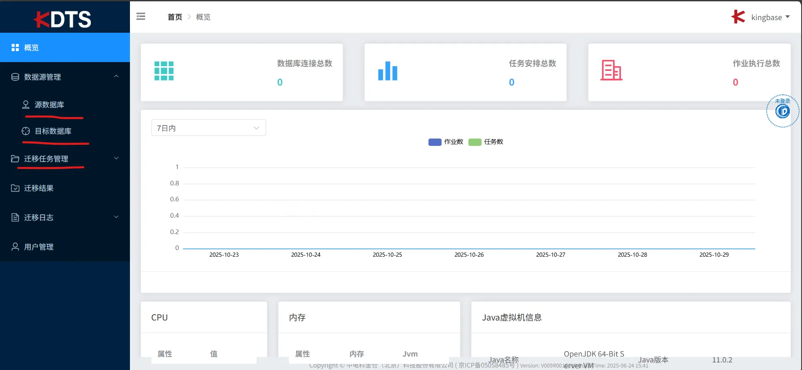

参考资料：

1.这篇文章并不完全准确，但有参考价值

[MYSQL数据库迁移KingBase人大金仓数据库一篇文章全搞定（附所遇问题即解决方案）_mysql迁移kingbase-CSDN博客](https://blog.csdn.net/m0_67864787/article/details/144347145?fromshare=blogdetail&sharetype=blogdetail&sharerId=144347145&sharerefer=PC&sharesource=weixin_46505567&sharefrom=from_link)

2.主要的参考文章--官方文档

[MySQL至KingbaseES迁移最佳实践 | KingbaseES](https://docs.kingbase.com.cn/cn/KES-V9R1C10/migration/best_practice/mysql_best_practice#%E8%BF%81%E7%A7%BB%E5%87%86%E5%A4%87)

3.错误汇总的文章

[国产数据库人大金仓踩坑记录和函数适配_com.kingbase8.util.ksqlexception: error: column do-CSDN博客](https://blog.csdn.net/u010882234/article/details/107381753?fromshare=blogdetail&sharetype=blogdetail&sharerId=107381753&sharerefer=PC&sharesource=weixin_46505567&sharefrom=from_link)

## 操作步骤：
1.账户

(1)mysql 

版本：8.0，用户：root 密码：##EDC2wsx1qaz

(2)kingbase

版本：V9R1C10，用户：kingbase

V9:用户：kingabse,密码：Kb_DI@2019

V8:用户：kingbase,密码：kingbase

迁移账号：

数据库：flask_web

用户：flask_web 密码：123456

# 一、从0到1的迁移
## 1.迁移前准备
**数据库、用户和模式迁移**

数据库、用户和模式迁移主要包括以下内容：

+ 获取源 MySQL 数据库的 IP 地址、实例名、网络服务端口号、用户名/密码等信息。
+ 在目的 KingbaseES 数据库上，使用 KSQL 工具上执行如下操作：
    - 创建与源 MySQL 用户同名的用户，用户root。
    - 创建与源 MySQL 同名的数据库，mysql。
    - 创建与源 MySQL 同名的模式。
+ 大小写处理。
+ 迁移 MySQL 时，注意 Kingbase 的 data 需要使用指定的初始化参数来初始化数据库。

 initdb --enable-ci --dbmode=mysql 


#### （1）初始化数据库命令：
```plain
# 切换到执行目录
cd /opt/Kingbase/ES/V9/Server/bin
## 初始化数据库
./initdb -D /data/kingbase --enable-ci --dbmode=mysql
```

注意的是：

系统用户会修改为kingbase

成功界面


#### （2）启动数据库
```plain
# 切换到执行目录
cd /opt/Kingbase/ES/V9/Server/bin
./sys_ctl -D /data/kingbase start
```

成功界面：


#### （3）创建用户--flask_web
```plain
1.创建专有的用户flask_web
create user flask_web with superuser password '123456';  #使用单引号
2.查看所有用户
SELECT usename FROM sys_user;

1.创建用户
create user flask_web with  password '123456';
create database flask_web owner flask_web;
2.授予权限usage,和schma
GRANT USAGE ON SCHEMA flask_web TO flask_web;
GRANT ALL PRIVILEGES ON ALL TABLES IN SCHEMA flask_web TO flask_web;
3.导入数据库命令：
ksql -Uflask_web -d flask_web < /root/flask_web.sql
没有schema先创建schema：flask_web ,
create schema flask_web；

用户flask_web会自动创建schema，flask_web

3.迁移用到数据库flask_web
create database flask_web;
```

创建成功：

#### （3）启动KDTS
```plain
# 切换kingbase迁移工具--KDTS
cd /opt/Kingbase/ES/V9/ClientTools/guitools/KDts/KDTS-WEB/bin
## 启动KDTS
./startup.sh 

查看日志：
tail -f ../logs/kdts-app-console_2025-10-29_14-58-47.log
```

日志查看成功界面：

## 2.迁移实施
#### （1）web界面


#### （2）源数据库：


#### （3）目标数据库


#### （4）迁移成功
注意的一点是：

不用勾选用户自定义类型


# 二、导入sql文件
#### (1)如果是用的Navicat到处的SQL文件，
会出现报错，因为kingbase需要创建schema和seqence,

```plain
-- 1. 授予模式使用权限
GRANT USAGE ON SCHEMA flask_web TO flask_web;

-- 2. 授予现有表的全部权限
GRANT ALL PRIVILEGES ON ALL TABLES IN SCHEMA flask_web TO flask_web;

-- 3. 授予序列的权限（如果表有自增字段）
GRANT ALL PRIVILEGES ON ALL SEQUENCES IN SCHEMA flask_web TO flask_web;

-- 4. 授予未来新建表的默认权限（可选，但很重要）
ALTER DEFAULT PRIVILEGES IN SCHEMA flask_web GRANT ALL PRIVILEGES ON TABLES TO flask_web;
ALTER DEFAULT PRIVLEGES IN SCHEMA flask_web GRANT ALL PRIVILEGES ON SEQUENCES TO flask_web;

导入的命令：
ksql -Uflask_web -d flask_web < /root/flask_web.sql
```

#### (2)使用kingbase的工具导出
```plain
不用再创建schema，直接可以使用
sys_dump   -U flask_web -d flask_web --clean --if-exists -f backup.sql
```

# 三、KingbaseV8的迁移
主要的问题是账号和密码的改变

V8:

用户：kingbase

密码：kingbase

# 四、遇到的问题：
### 1.初始化数据库时。
系统用户改变，不指定mysql，系统用户为：system；指定mysql，系统用户为：kingbase

### 2.启动KDTS时，出现报错
解决办法：

chown -R kingbase:kingbase /opt/Kingbase/ES/V9/ClientTools/guitools/KDts/KDTS-WEB/pid

chown -R kingbase:kingbase /opt/Kingbase/ES/V9/ClientTools/guitools/KDts/KDTS-WEB/logs/

### 3.最主要的问题，
停留很长时间


```plain
ERROR ... The target owner 'flask_web' does not exists.
ERROR ... 目标模式 {0} 创建失败
这说明：程序要找的不是“数据库”，
而是“用户（owner）”或“模式（schema）”，并且它不存在。
```

解决办法：

```plain
1.创建专有的用户
create user flask_web with superuser password '123456';  #使用单引号
2.查看所有用户
SELECT usename FROM sys_user;

用户flask_web会自动创建schema，flask_web
```

了解database和schema的区别

